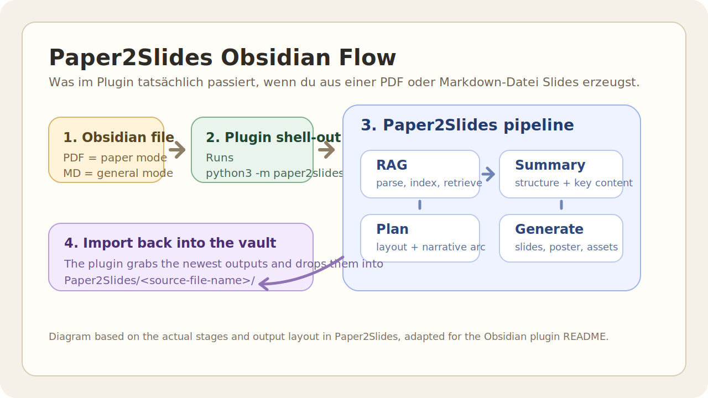

# Paper2Slides for Obsidian

An Obsidian desktop plugin for running [Paper2Slides](https://github.com/HKUDS/Paper2Slides) from inside your vault and pulling the latest outputs back in.

This plugin does not generate slides on its own. It connects Obsidian to a local `Paper2Slides` checkout, starts the upstream CLI, tracks the run, and imports the newest results into your vault.

## What you get

- Settings tab inside Obsidian
- Ribbon button for the current file
- Right-click menu on PDFs and Markdown notes
- Command palette actions for generate, re-import, setup check, and stop
- Real generation options instead of hardcoded defaults
- Run logs saved into the imported output folder

## Use it in a minute

1. Get the original `Paper2Slides` repo running on your machine
2. Make sure its Python dependencies, API keys, and `.env` are in place
3. Build this plugin and drop it into `.obsidian/plugins/paper2slides-obsidian/`
4. Open the plugin settings in Obsidian
5. Set:
   - `Python command`, usually `python3`
   - `Paper2Slides repo path`, pointing to your local checkout
   - any generation defaults you want
6. Trigger it from one of these places:
   - the ribbon button
   - the command palette
   - the right-click menu on a PDF or Markdown note
7. Open `Paper2Slides/<source-file-name>/` in the vault after the run finishes

If the upstream `Paper2Slides` setup is broken, this plugin will not generate anything either.

## Actual workflow

- PDFs run in `paper` mode
- Markdown notes run in `general` mode
- The plugin starts `python3 -m paper2slides`
- `Paper2Slides` handles parsing, summary, planning, and generation
- The plugin imports the newest summary, PDFs, PNGs, and `last-run.log` back into the vault

## In-app controls

- Settings tab:
  Python path, repo path, output type, slides length, poster density, style, custom style prompt, fast mode, parallel workers, import root, save run log
- Ribbon button:
  generate for the active PDF or Markdown note
- Right-click menu:
  generate or re-import the latest outputs for a file
- Command palette:
  generate, re-import, check setup, stop current run

## Setup notes

1. Clone the original `Paper2Slides` repo
2. Install its dependencies
3. Configure `paper2slides/.env`
4. Run `npm install`
5. Run `npm run build`
6. Copy `manifest.json`, `main.js`, and `versions.json` into `.obsidian/plugins/paper2slides-obsidian/`
7. Enable the plugin in Obsidian
8. Run `Check Paper2Slides setup` once before the first real job

## Credit

This repo only covers the Obsidian side of the workflow.

- Original project: [HKUDS/Paper2Slides](https://github.com/HKUDS/Paper2Slides)
- The actual slide generation pipeline lives there
